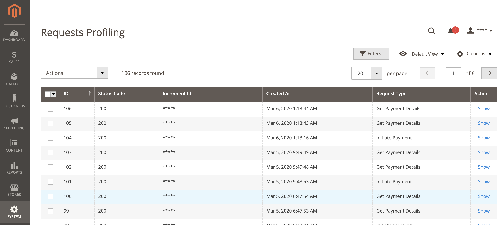

# DEBUG

If you have experienced any issues with Vipps, try to enable *Request Profiling* or *Debug* features
in the Vipps payment configuration area: *Stores > Configuration > Sales > Payment Methods > Vipps*.

## Requests Profiling

Requests Profiling is a page in Magento admin panel that helps you to track a communication between Vipps and Magento.
You can find the page under *System* > *Vipps*.

On the page you can see the list of all requests for all orders that Magento sends to Vipps.
By clicking on *Show* in the *Action* column of grid you can find appropriate response from Vipps.

Using the built-in Magento grid filter, you could easily find all requests per order that you are interested in.

## Debugging Log Files

Logs which are related to the Vipps payment module are located under two files:
* `{project_root}/var/log/vipps_exception.log`
* `{project_root}/var/log/vipps_debug.log`
