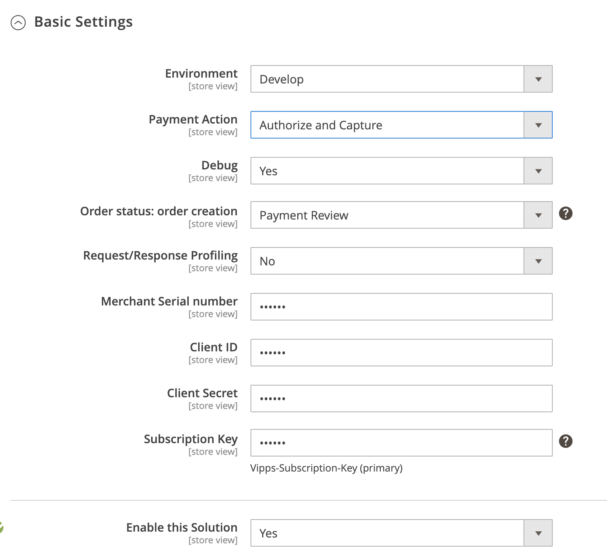

# Prerequisites

1. Magento 2 installed ([Magento 2.2.x](https://devdocs.magento.com/guides/v2.2/release-notes/bk-release-notes.html), [Magento 2.3.x](https://devdocs.magento.com/guides/v2.3/release-notes/bk-release-notes.html), [Magento 2.4.x](https://devdocs.magento.com/guides/v2.4/release-notes/bk-release-notes.html))
1. SSL must be installed on your site and active on your Checkout pages.
1. You must have a Vipps merchant account. See [Vipps på Nett](https://www.vipps.no/bedrift/vipps-pa-nett)
1. As with _all_ Magento extensions, it is highly recommended to backup your site before installation and to install and test on a staging environment prior to production deployments.

# Installation 

## Installation via Composer

1. Navigate to your [Magento root directory](https://devdocs.magento.com/guides/v2.4/extension-dev-guide/build/module-file-structure.html).
1. Enter command: `composer require vipps/module-payment`
1. Enter command: `php bin/magento module:enable Vipps_Payment` 
1. Enter command: `php bin/magento setup:upgrade`
1. Put your Magento in production mode if it’s required.

## Installation via Marketplace

Here are steps required to install Payments extension via Component Manager.

1. Make a purchase for the Vipps extension on [Magento Marketplace](https://marketplace.magento.com/vipps-module-payment.html).
1. From your Magento Admin access System -> Web Setup Wizard page.
1. Enter Marketplace authentication keys. Please read about authentication keys generation.
1. Navigate to Component Manager page.
1. On the Component Manager page click the `Sync button to update your new purchased extensions.
6. Click Install in the Action column for Realex Payments component.
7. Follow Web Setup Wizard instructions.  

# Configuration
The Vipps Payment module can be easily configured to meet business expectations of your web store. This section will show you how to configure the extension via `Magento Admin Panel`.

1. From Magento Admin navigate to `Store` -> `Configuration` -> `Sales` -> `Payment Methods` section. 
1. On the Payments Methods page the Vipps Payments method should be listed together with other installed payment methods in a system.
1. By clicking the `Configure` button, all configuration module settings will be shown. 
1. Once you have finished with the configuration simply click `Close` and `Save` button for your convenience.
1. [Clear Magento Cache.](https://devdocs.magento.com/guides/v2.4/config-guide/cli/config-cli-subcommands-cache.html)

## Add a separate connection for Vipps resources
These settings are required to prevent profiles loss when Magento reverts invoice/refund transactions.  

* Duplicate 'default' connection in app/etc/env.php and name it 'vipps'. It should look like:
```         
         'vipps' => array (
             'host' => 'your_DB_host',
             'dbname' => 'your_DB_name',
             'username' => 'your_user',
             'password' => 'your_password',
             'model' => 'mysql4',
             'engine' => 'innodb',
             'initStatements' => 'SET NAMES utf8;',
             'active' => '1',
         ),
```
* Add also the following configuration to 'resource' array in the same file:
```
         'vipps' => array (
             'connection' => 'vipps',
         ),
```

## Enable debug mode / requests profiling

If you have experienced any issue with Vipps try to enable `Request Profiling` and `Debug` features under vipps payment configuration area: 

`Stores -> Configuration -> Sales -> Payment Methods -> Vipps`

After that, all information related to vipps payment module will be stored into two files `{project_root}/var/log/vipps_exception.log` or `{project_root}/var/log/vipps_debug.log`.

Requests Profiling is a page in Magento admin panel that helps you to track a communication between Vipps and Magento.
You can find the page under `System -> Vipps`


On the page you can see the list of all requests for all orders that Magento sends to Vipps. 
By clicking on a link `Show` in an `Action` column of grid you can find appropriate response from Vipps.

Using built-in Magento grid filter you could find all requests per order that you are interested in.

# Settings

Vipps Payments configuration is divided by sections. It helps to quickly find and manage settings of each module feature:

1. Basic Vipps Settings.
1. Express Checkout Settings.
1. Additional Settings.


Please ensure you check all configuration settings prior to using Vipps Payment. Pay attention to the Vipps Basic Settings section, namely `Saleunit Serial Number`, `Client ID`, `Client Secret`, `Subscription Key`.

For information about how to find the above values, see the [Vipps Developer documentation](https://developer.vippsmobilepay.com/).

## Basic Vipps Settings



**Environment**  - Vipps API mode. Can be *production/develop*.  
**Payment Action** - *Authorize*(process authorization transaction; funds are blocked on customer account, but not withdrawn) or *Capture* (withdraw previously authorized amount).  
**Order Status** - default order status before redirecting back to Magento. Can be *Pending* or *Payment Review*.  
**Debug** - log all actions with Vipps Payment module into `{project_root}/var/log/vipps_debug.log` file *(not recommended in production mode)*.  
**Request/Response Profiling** - log all requests/responses to Vipps API into `vipps_profiling` table.

## Express Checkout Settings


## Additional Settings


**Process type** - whether cancel quote automatically or not.  
**Enable Partial Void** - allow cancellation for captured(not refunded) transaction (mostly used to cancel order item).

# Quote Monitoring

Quote it is a cart contents in Magento. Theoretically the quote is an offer and if the user accepts it (by checking out) it converts to order.

When payment has been initiated (customer redirected to Vipps) Magento creates a new record on `Vipps Quote Monitoring` page and starts tracking an Vipps order.
To do that Magento has a cron job that runs by schedule/each 10 min.

You can find this page under `System -> Vipps` menu section. Under `Store -> Sales -> Payment Methods -> Vipps -> Cancellation` you can find appropriate configuration settings.

# Order handling
Please refer to Magento official documentation to learn more about [order processing](https://docs.magento.com/user-guide/sales/order-processing.html)

## How do I capture an order?
When Payment Action is set to Authorize and Capture invoice is created automatically in Magento. In such a case, the Invoice button does not appear, and the order is ready to ship.
For more details about capturing order refer to [Creating an Invoice documentation](https://docs.magento.com/user-guide/sales/invoice-create.html).

## How do I partially capture an order?
Visit invoice page of your order by click `Invoice` button on order page. In the `Items to Invoice` section, update the `Qty to Invoice` column to include only specific items on the invoice.
Then, click `Update Qty’s` and submit Invoice.

## How do I cancel an order?
In Magento an order can be canceled in case when all invoices and shipments has been returned. When Vipps Payment transaction has not been captured. 
Otherwise, refund should be finished first. Vipps Payment module supports offline partial cancellation. It is used to cancel separate order items.

## How do I refund an order?
For orders refunding Magento propose [Credit Memo](https://docs.magento.com/user-guide/sales/credit-memos.html) functionality.
Credit Memo allows to make a refund for captured transaction.

## How do I partially refund an order?
It can be done by specifying `Items to Refund` on `Credit Memo` page and updating `Qty to Refund` field.

# Additional info

Please contact by [support](https://github.com/vippsas/vipps-magento/wiki)
