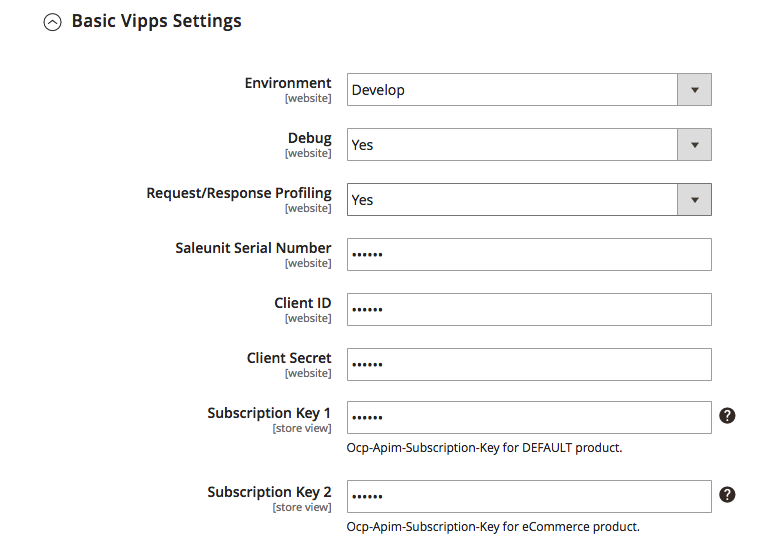

# Vipps Payment Module for Magento 2: Installation

# Prerequisites

1. Magento 2.2+
1. SSL is installed on your site and active on Checkout pages.
1. Vipps merchant account. See https://www.vipps.no/vilkar/vipps-terms-and-conditions 
1. As with ALL Magento extensions, it is highly recommended to backup your site before installation and to install and test on a staging environment prior to production deployments.

# Installation via Composer (recommended)

1. Navigate to your [Magento root directory](https://devdocs.magento.com/guides/v2.2/extension-dev-guide/build/module-file-structure.html).
1. Enter command: `composer require vipps/module-payment`
1. Enter command: `php bin/magento module:enable Vipps_Payment` 
1. Enter command: `php bin/magento setup:upgrade`
1. Put your Magento in production mode if it’s required.

# Installation via Marketplace

Here are steps required to install Payments extension via Component Manager.

1. Make a purchase for vipps extension on [Magento Marketplace](https://marketplace.magento.com).
1. From your Magento® Admin access `System` -> `Web Setup Wizard` page.
1. Enter Marketplace authentication keys. Please read about authentication keys generation. 
1. Navigate to `Component Manager` page.
1. On the `Component Manager` page click the `Sync button to update your new purchased extensions.
1. Click `Install` in the `Action` column for `Realex Payments` component.
1. . Follow Web Setup Wizard instructions.

# Configuration

The Vipps Payment module can be easily configured to meet business expectations of your web store. This section will show you how to configure the extension via Magento® Admin.

From Magento Admin navigate to `Store` -> `Configuration` -> `Sales` -> `Payment Methods` section. On the Payments Methods page the Vipps Payments method should be listed together with other installed payment methods in a system.

By clicking the `Configure` button, all configuration module settings will be shown. Once you have finished with the configuration simply click `Close` and `Save` button for your convenience.

# Settings

Vipps Payments configuration is divided by sections. It helps to quickly find and manage settings of each module feature:

1. Basic Vipps Settings.
1. Express Checkout Settings.

Please ensure you check all configuration settings prior to using Vipps Payment. Pay attention to the Vipps Basic Settings section, namely Saleunit Serial Number, Client ID, Client Secret, Subscription Key 1, Subscription Key 2.

# Basic Vipps Settings

# Express Checkout Settings

# Support

Magento is an open source ecommerce solution: https://magento.com

Magento Inc is an Adobe company: https://magento.com/about

For Magento support, see Magento Help Center: https://support.magento.com/hc/en-us

Vipps has a dedicated team ready to help get you set up or answer your questions: magento@vipps.no
