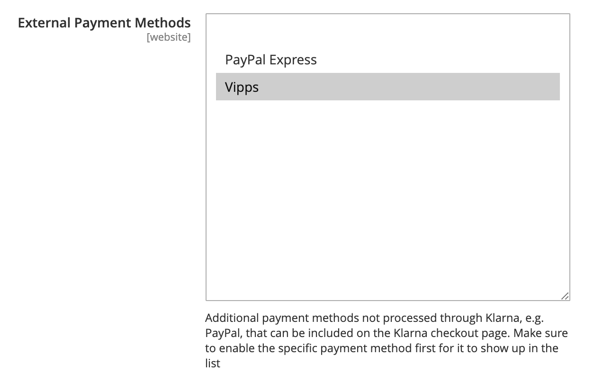

<!-- START_METADATA
---
title: Vipps Payment Module for Magento 2 FAQ
sidebar_label: FAQ
sidebar_position: 50
pagination_next: null
pagination_prev: null
---
END_METADATA -->

# Frequently asked questions

## How do I capture an order?

When *Payment Action* is set to *Authorize* and *Capture*, the invoice is created automatically in Magento. In such a case, the *Invoice* button does not appear, and the order is ready to ship.
For more details about capturing orders, refer to [Creating an Invoice documentation](https://docs.magento.com/user-guide/sales/invoice-create.html).

## How do I partially capture an order?

Visit the invoice page of your order by clicking the *Invoice* button on the order page. In the *Items to Invoice* section, update the *Qty to Invoice* column to include only specific items on the invoice.
Then, click *Update Qty’s* and submit *Invoice*.

## How do I cancel an order?

In Magento, an order can be canceled in the case where all invoices and shipments have been returned and the Vipps Payment transaction has not been captured.
Otherwise, the refund should be finished first. The Vipps Payment module supports offline partial cancellation. It is used to cancel separate order items.

## How do I refund an order?

For orders refunding Magento propose [Credit Memo](https://docs.magento.com/user-guide/sales/credit-memos.html) functionality.
Credit Memo allows you to make a refund for captured transaction.

## How do I partially refund an order?

You can partially refund an order by specifying *Items to Refund* on the *Credit Memo* page and updating the *Qty to Refund* field.

## How can I get help with Vipps for Magento?

Vipps for Magento is developed by [Vaimo](https://www.vaimo.com), and the same developers who made
the plugin also help with improvements, maintenance and developer assistance.

If you are having a problem, please make sure that you are using the latest version:
<https://github.com/vippsas/vipps-magento/releases>

The best way to report a problem (or ask a question) is to use GitHub's built-in "issue" functionality:
[Issues](https://github.com/vippsas/vipps-magento/issues).

### How can I get help with Vipps (unrelated to Magento)?

See: [How to contact Vipps](https://developer.vippsmobilepay.com/docs/vipps-developers/contact/).

## Why does it take so long after purchase before orders are created in Magento?

Vipps depends on a proper cron job configuration for background processing of orders.
Failure to set it up properly means Vipps will not function as expected.

## Why are some orders missing in Magento?

This scenario is possible for express payment flow. Unlike of regular payment, order is not created before redirecting to
Vipps Landing page. If the transaction was successfully initiated by client, a new record
with a quote ID and reserved order ID will be created in DB table `vipps_quote`. This can be helpful to find a status of a transaction.

## How do I enable Vipps Payment for Klarna Checkout

To enable Vipps Payment method for Klarna Checkout, it should be chosen in the list of external payment methods in the appropriate Klarna Checkout settings section.

### Why am I seeing a strange page with url printed?

Right after pressing *Place Order*, the client may see the page with message
`{"url":"https:\/\/apitest.vipps.no\/dwo-api-application\/v1\/****"}`

**Solution:** Update your Vipps module to the latest version.

## How to enable debug mode / requests profiling

If you have experienced any issue with Vipps try to enable *Request Profiling* and *Debug* features under the Vipps payment configuration area:

*Stores -> Configuration -> Sales -> Payment Methods -> Vipps*

After that, all information related to Vipps payment module will be stored into two files `{project_root}/var/log/vipps_exception.log` or `{project_root}/var/log/vipps_debug.log`.

Requests Profiling is a page in Magento admin panel that helps you to track a communication between Vipps and Magento.
You can find the page under `System -> Vipps`

On the page, you can see the list of all requests for all orders that Magento sends to Vipps.
By clicking *Show* in an *Action* column of grid you can find appropriate response from Vipps.

Using built-in Magento grid filter you could find all requests per order that you are interested in.

