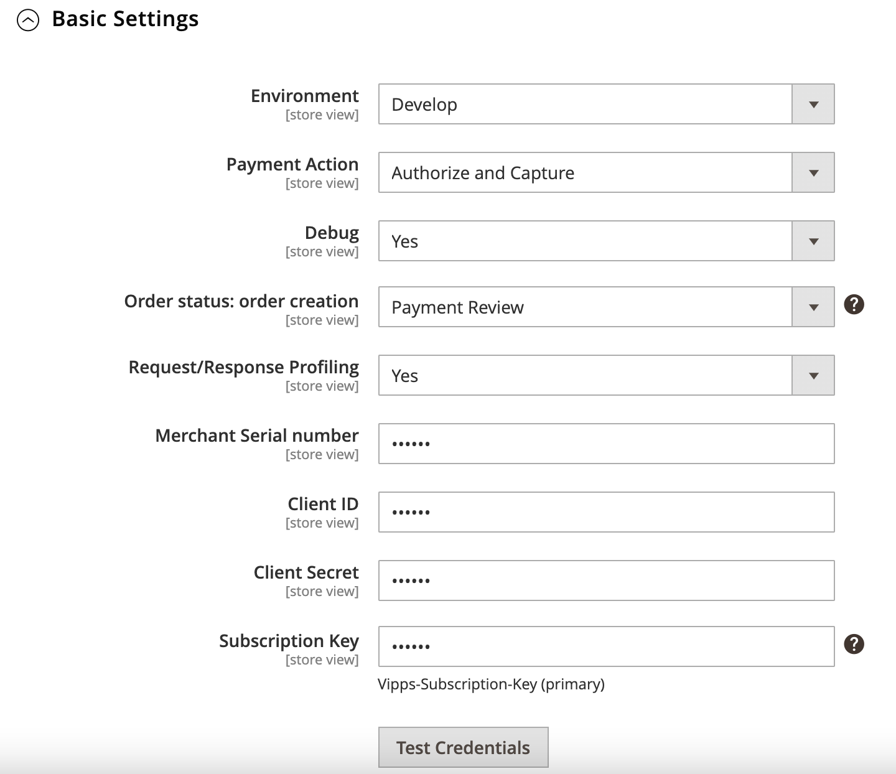
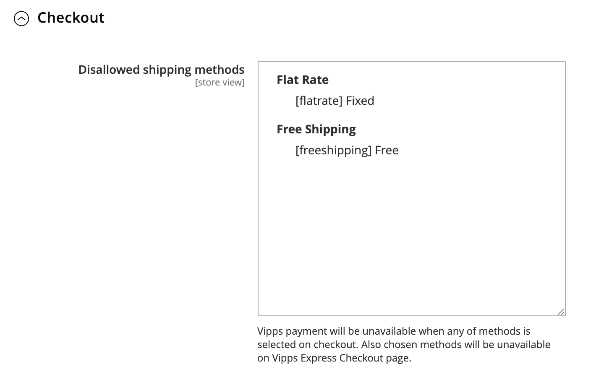
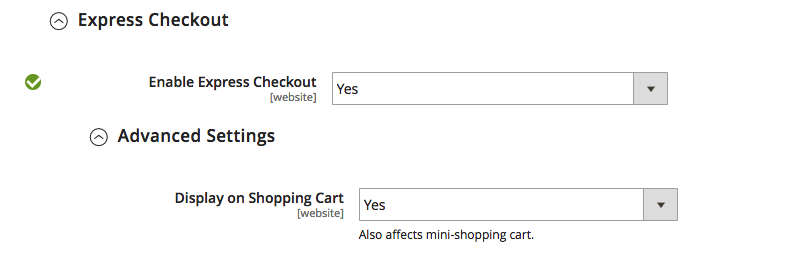
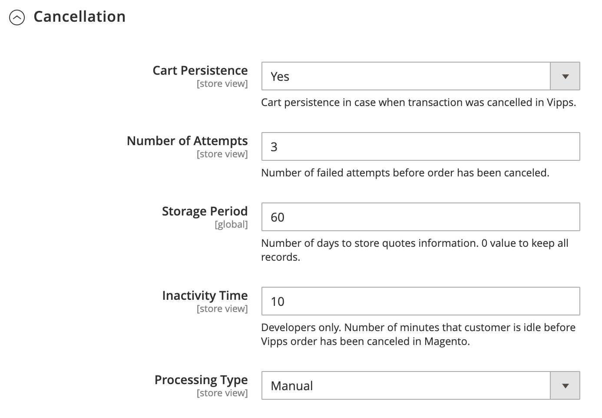
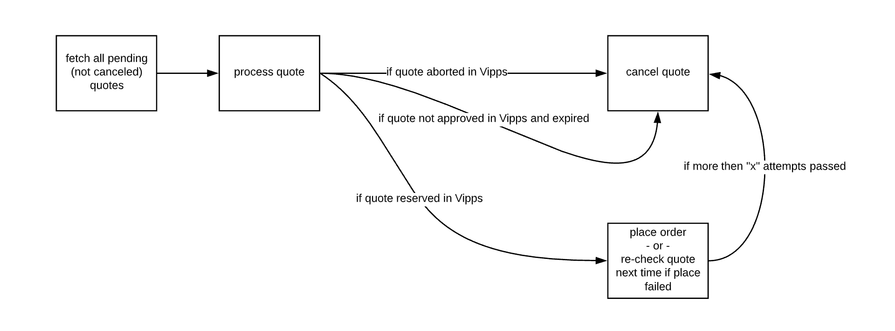
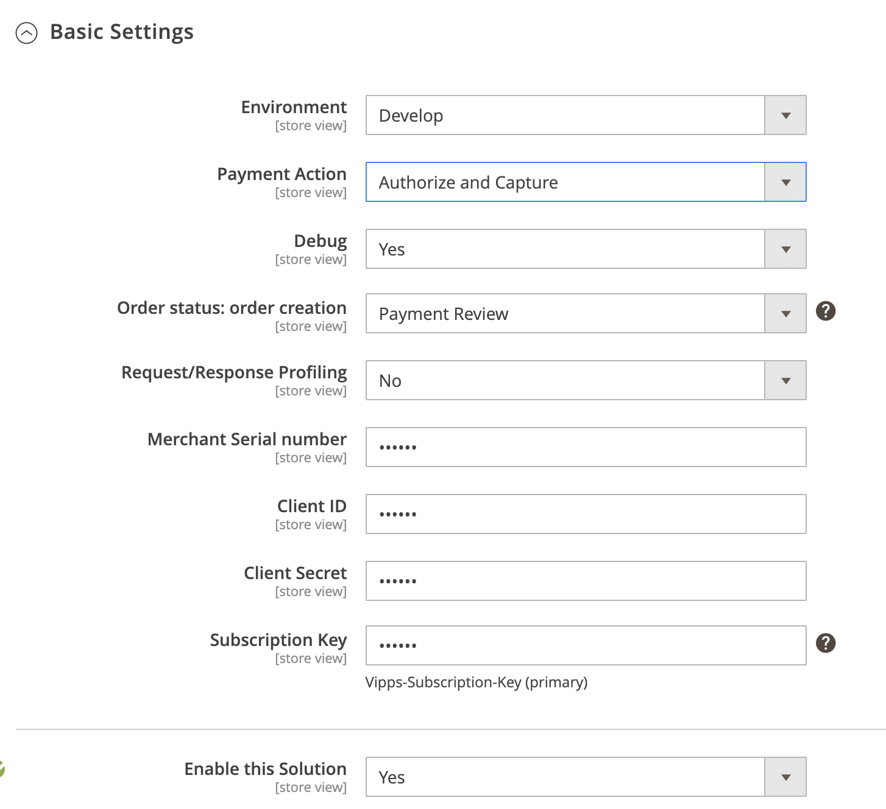
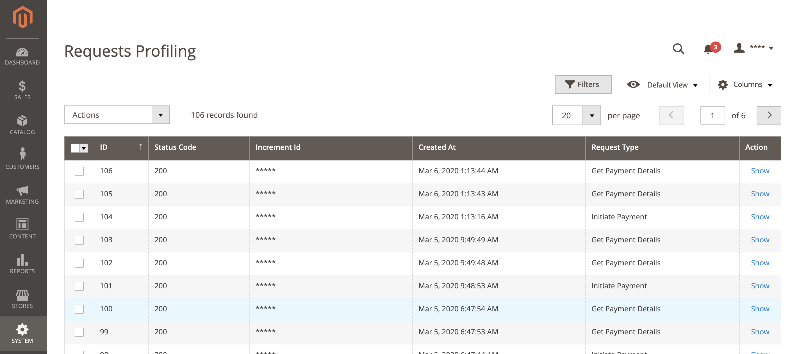
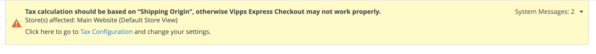
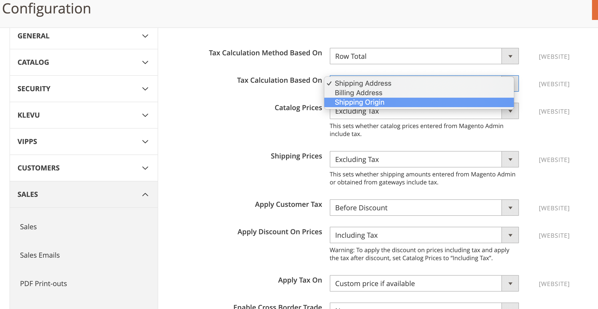

# Vipps Payment Module for Magento 2: User Guide

## Prerequisites

* Magento 2 installed ([Magento 2.2.x](https://devdocs.magento.com/guides/v2.2/release-notes/bk-release-notes.html), [Magento 2.3.x](https://devdocs.magento.com/guides/v2.3/release-notes/bk-release-notes.html), [Magento 2.4.x](https://devdocs.magento.com/guides/v2.4/release-notes/bk-release-notes.html))
  * [Magento 2 System Requirements](https://experienceleague.adobe.com/docs/commerce-operations/installation-guide/system-requirements.html)
* SSL must be installed on your site and active on your Checkout pages.
* You must have a Vipps merchant account. [Sign up here](https://vippsbedrift.no/signup/vippspanett/).
* As with *all* Magento extensions, it is highly recommended backing up your site before installation and to install and test on a staging environment prior to production deployments.
* Supported protocols HTTP1/HTTP1.1
  * Magento relies on the [Zend Framework](https://framework.zend.com), which does not support HTTP/2.
  * HTTP/1.1 must therefore be "forced", typically by using [CPanel](https://documentation.cpanel.net/display/EA4/Apache+Module%3A+HTTP2) or similar.

## Installation

### Installation via Composer

1. Navigate to your [Magento root directory](https://devdocs.magento.com/guides/v2.4/extension-dev-guide/build/module-file-structure.html).
1. Enter command: `composer require vipps/module-payment`
1. Enter command: `php bin/magento module:enable Vipps_Payment`
1. Enter command: `php bin/magento setup:upgrade`
1. Put your Magento in production mode, if required.

### Installation via Marketplace

Here are steps required to install Payments extension via Component Manager.

1. Make a purchase for the Vipps extension on [Magento Marketplace](https://marketplace.magento.com/vipps-module-payment.html).
1. From your Magento Admin, access *System* > *Web Setup Wizard* page.
1. Enter Marketplace authentication keys. Please read about authentication keys generation.
1. Navigate to *Component Manager* page.
1. On the *Component Manager* page, click the *Sync* button to update your new purchased extensions.
1. Click *Install* in the *Action* column for Realex Payments component.
1. Follow *Web Setup* Wizard instructions.

## Configuration

The Vipps Payment module can be easily configured to meet business expectations of your web store. This section will show you how to configure the extension via the *Magento Admin Panel*.

1. From Magento *Admin*, navigate to *Store* > *Configuration* > *Sales* > *Payment Methods* section.
1. On the *Payments Methods* page, the *Vipps Payments* method should be listed together with other installed payment methods in a system.
1. By clicking the *Configure* button, all configuration module settings will be shown.
1. Once you have finished the configuration, click *Close* and *Save* button.
1. [Clear Magento Cache](https://devdocs.magento.com/guides/v2.4/config-guide/cli/config-cli-subcommands-cache.html).


### Add a separate connection for Vipps resources

These settings are required to prevent the loss of profiles when Magento reverts invoice or refund transactions.

* Duplicate the `default_connection` in `app/etc/env.php` and name it 'vipps'. It should look like:

```php
'vipps' => [
    'host' => 'your_DB_host',
    'dbname' => 'your_DB_name',
    'username' => 'your_user',
    'password' => 'your_password',
    'model' => 'mysql4',
    'engine' => 'innodb',
    'initStatements' => 'SET NAMES utf8;',
    'active' => '1',
],
```

* Then, add the following configuration to the `resource` array in the same file:

```php
'vipps' => [
    'connection' => 'vipps',
],
```

## Settings

The Vipps Payments configuration is divided by sections. It helps to quickly find and manage settings of each module feature:

* [Basic Settings](#basic-settings)
* [Checkout settings](#checkout-settings)
* [Express Checkout Settings](#express-checkout-settings)
* [Cancellation Settings](#cancellation-settings)

Ensure that you check all configuration settings before using Vipps Payment. Pay special attention to the [Basic Settings](#basic-settings) section.

### Basic Settings

Basic Settings include:

* *Environment* - Vipps API mode, which can be *Production* or *Develop*.
* *Payment Action* - *Authorize* (process authorization transaction; funds are blocked on customer account, but not withdrawn) or *Capture* (withdraw previously authorized amount).
* *Debug* - Log all actions with Vipps Payment module into `{project_root}/var/log/vipps_debug.log` file *(not recommended in production mode)*.
* *Order Status* - Default order status before redirecting back to Magento. Can be *Pending* or *Payment Review*.
* *Request/Response Profiling* - Log all requests/responses to Vipps API into `vipps_profiling` table.
* *Merchant Serial Number* - ID number for the sales unit.
* *Client ID* - Client ID for the sales unit (the "username").
* *Client Secret* - Client secret for the merchant (the "password").
* *Subscription Key* - Subscription key for the API product.

See [API keys](https://developer.vippsmobilepay.com/docs/vipps-developers/common-topics/api-keys/) for information about how to find the values for *Merchant Serial Number*, *Client ID*, *Client Secret*, and *Subscription Key*.



### Checkout Settings

Vipps payment will be unavailable when disallowed shipping methods are selected on checkout. These methods are also unavailable on the Express Checkout page.



### Express Checkout Settings



### Cancellation Settings

The Cancellation Settings include:

 - *Cart Persistence* - If set to *Yes* and client cancels an order on Vipps side, the cart will still contain the recently added products.
 - *Number of Attempts* - The number of failed order placement attempts allowed before the order will be canceled.
 - *Storage Period* - The number of days to store the quote information. Use `0` to keep all records.
 - *Inactivity Time* - (Developers only) The number of minutes that customer is idle before the Vipps order will be canceled in Magento.
 - *Processing Type* - Deprecated setting that will be removed in future releases. (Should be set to "Automatic").




## Order processing

Please refer to the Magento official documentation to learn more about [order processing](https://docs.magento.com/user-guide/sales/order-processing.html) and [order management](https://docs.magento.com/m2/ce/user_guide/sales/order-management.html).

### Quote Processing Flow

The quote is an offer. The user accepts the offer when checking out, and it is converted to an order.

When the payment has been initiated (customer redirected to Vipps), Magento creates a new record on the *Quote Monitoring* page and starts tracking a Vipps order.
To do that, Magento has a cron job that runs by schedule/each 10 minutes.

You can find this page under the *System* > *Vipps* menu. For the cancellation configuration settings, see *Store* > *Sales* > *Payment Methods* > *Vipps* > *Cancellation*.

1. When a payment is initiated, a new record is created on the Vipps *Quote Monitoring* page with status `New`.
   - For a "Regular Payment", the order is immediately placed on the Magento side with status *new*, *pending*, or *payment review*, depending on the configuration.

1. Magento regularly (by cron) polls Vipps for orders to process.
1. When an order is accepted on Vipps side, Magento tries to place the order and marks a record as `Placed`
   - For a "Regular Payment", the Magento order is moved to status `Processing`.

1. When an order is cancelled on the Vipps side, Magento marks such record as `Cancelled`.
   - The order is canceled on the Magento side, if it was previously placed.

1. If an order has not been accepted on the Vipps side within some period of time, it marked as expired. Magento subsequently marks the order as `Expired`.
   - The order is canceled on the Magento side, if it was previously placed.

1. If an order has not been yet been accepted on the Vipps side and has not yet expired, Magento marks it as `Processing`. An appropriate message is added on *Record details* page.
1. If an order has been accepted on the Vipps side, but an error has occurred during order placement on Magento side, such record marks as `Processing`. An appropriate message is added on record details page.
1. Magento will attempt to process a record three times. After it fails three times, the record is marked as `Place Failed`.
1. It is possible to specify that Magento must cancel a Vipps order automatically when an appropriate Magento quote has failed, so that client's money released. See *Store* > *Sales* > *Payment Methods* > *Vipps* > *Cancellation*.
1. If it is specified that Magento must cancel all failed quotes, then Magento fetches all records marked as `Place Failed`, cancels them, and marks them as `Cancelled`.

Here is a diagram of the process:




## Quote Monitoring Tool

From version 1.2.1, we released *Quote Monitoring*.

Quote Monitoring simplifies detection of failed order placement and identifies the root causes of failures.

The monitoring tool is located under *System* > *Vipps Payment* > *Quote Monitoring*.
This page displays all orders that were attempted to be placed.
Each record in the list provides detailed information about order creation flow: current status, list of attempts, each attempt results.

Monitoring quote statuses include:

* *New* - Payment is initiated on the Vipps side.
* *Processing* - Magento has started processing for initiated payment.
* *Placed* - The order has been placed.
* *Expired* - The customer has not approved payment for some time.
* *Placement Failed* - All attempts were unsuccessful.
* *Canceled* - The payment has been canceled.
  Cancellation can be initiated by the customer in Vipps or manually/automatically by *Magento for Quotes* in *Placement Failed* status.
* *Cancel Failed* - The payment could not be canceled. Record in this status and require admin/developer interaction.

## Enable debug mode / requests profiling

If you have experienced any issue with Vipps, try to enable *Request Profiling* and *Debug* features in the Vipps payment configuration area: *Stores* > *Configuration* > *Sales* > *Payment Methods* > *Vipps*.



After that, all information related to the Vipps payment module will be stored into two files:

* `{project_root}/var/log/vipps_exception.log`
* `{project_root}/var/log/vipps_debug.log`

*Requests Profiling* is a page in the Magento *Admin panel* that helps you to track a communication between Vipps and Magento.
You can find the page under *System* > *Vipps*.



On the page, you can see the list of all requests for all orders that Magento sends to Vipps.
By clicking on *Show* in the *Action* column of the grid, you can find the appropriate response from Vipps.

By using the built-in Magento grid filter, you can find all requests per order that you are interested in.

## Tax Calculation for Express Checkout

When enabling the Express checkout payment in the configuration area, you may see a notification at the top of admin panel saying:


This means that you should change Tax Calculation Settings to be based on **Shipping Origin**:


Otherwise, an issue with calculating delivery cost might occur.

## Customization

The Magento platform provides various ways to create custom flows that are difficult and unnecessary to describe in one page. Here we provide a guide and references that can help you to understand the general idea of where to start.

For example, to customize the *Order Success* page, you can:

* Use an existing 3rd party module or by doing the customization yourself. Visit [Magento Marketplace](https://marketplace.magento.com/) to see which 3rd party solutions are available.

* Do the customization yourself. Refer to [Magento Frontend Developer Guide](https://devdocs.magento.com/guides/v2.4/frontend-dev-guide/bk-frontend-dev-guide.html).

   The following code is related to the *Order Success* page:

   - Template: `magento/module-checkout/view/frontend/templates/success.phtml`
   - Layout: `magento/module-checkout/view/frontend/layout/checkout_onepage_success.xml`
