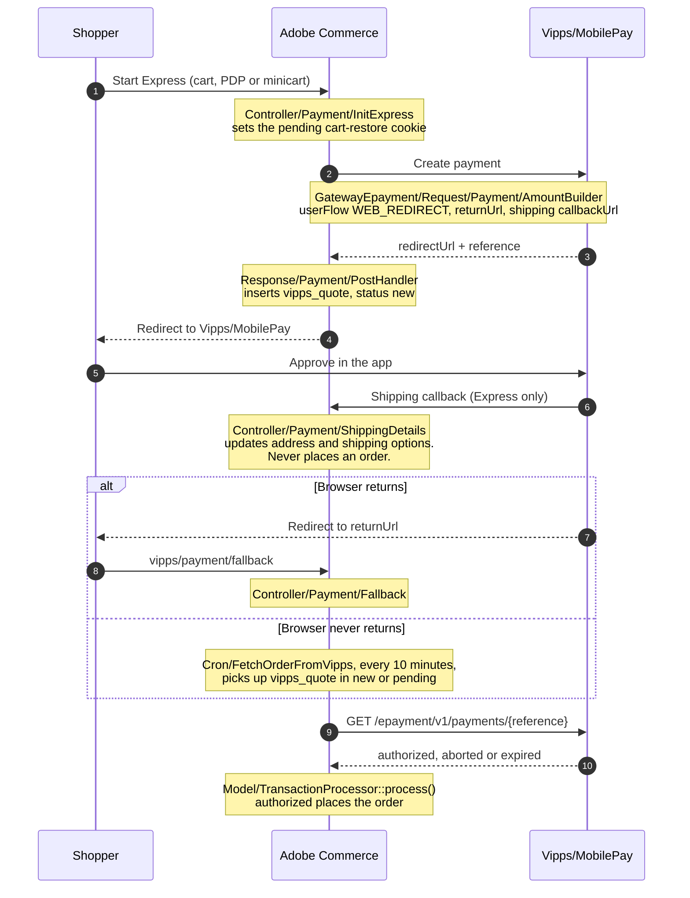

<!-- START_METADATA
---
title: Vipps/MobilePay Payment Module for Adobe Commerce payment flow
sidebar_label: Payment flow
sidebar_position: 30
description: How a payment moves through the module: where it is initiated, where its state is read, where the order is placed, and how it can be cancelled.
pagination_next: plugins-ext/magento/docs/FAQ
pagination_prev: plugins-ext/magento/docs/documentation
section: Plugins
---
END_METADATA -->

# Payment flow

A developer reference for how a payment travels through the module, and which class owns each
step. For the merchant view of the same thing (statuses, admin screens, configuration) see the
[user guide](documentation.md).

## The one thing to understand first

**Adobe Commerce always asks Vipps/MobilePay what happened. It is never told.**

Every route that ends in an order calls `GET /epayment/v1/payments/{reference}` and acts on the
state that comes back. The shopper's browser returning from the payment is a prompt to go and
look, not evidence that anything succeeded, and the module registers no completion webhook.

This matters because the browser may never come back. Payments are approved in the
Vipps/MobilePay app, so the shopper can finish paying and then close the browser, switch apps, or
have the tab evicted by the operating system. `userFlow` is `WEB_REDIRECT`, so the return URL only
fires if that tab regains focus. Nothing guarantees it will.

The `vipps_quote` table is what makes that survivable. It is the work queue: one row per initiated
payment, and `Cron/FetchOrderFromVipps` resolves every row in `new` or `pending` against Vipps
until it reaches a terminal state. A payment whose browser never returned is picked up there
instead, with no shopper involvement at all.

The corollary is the invariant worth protecting: **taking a row out of that queue abandons the
payment behind it.** If the status is moved to something terminal while the payment is still live,
nothing will ever look at it again, and the shopper can complete a payment that Adobe Commerce has
already stopped caring about. That is not hypothetical; it is what 3.0.2 and 3.0.3 did from the
Express cart restore, and it cost merchants real orders with the amount reserved at Vipps.

## Flow

## Where each step lives

| Step | Class | Writes |
|---|---|---|
| Express init | `Controller/Payment/InitExpress` | cart-restore cookie, deactivates the cart |
| Regular init | `Controller/Payment/InitRegular` | as above; the order is placed immediately |
| Request body | `GatewayEpayment/Request/Payment/AmountBuilder` | `returnUrl`, `userFlow`, Express shipping `callbackUrl` |
| Payment created | `GatewayEpayment/Response/Payment/PostHandler` | inserts `vipps_quote` with status `new` |
| Shipping chosen | `Controller/Payment/ShippingDetails` | quote address and shipping options only |
| Resolve, on return | `Controller/Payment/Fallback` | nothing directly; delegates |
| Resolve, on schedule | `Cron/FetchOrderFromVipps` | increments `attempts`, then delegates |
| Decide and act | `Model/TransactionProcessor::process()` | the `vipps_quote` status |
| Place the order | `Model/TransactionProcessor::placeOrder()` | `sales_order`, via `CartManagementInterface` |
| Link order to payment | `Observer/CheckoutSubmitAllAfter` | `vipps_quote.order_id` |

Only `Fallback` and `FetchOrderFromVipps` trigger resolution, and both funnel into the same
`TransactionProcessor::process()`. There is exactly one piece of code that creates an order.

A cart can carry several payments. Each press of the Express button creates another monitoring
quote with its own reference, and nothing links them: `reserved_order_id` is unique, `quote_id` is
only indexed. A Magento cart still converts to exactly one order, so `processReservedTransaction()`
checks the cart and not just the reference before placing. Without that, a shopper who approved two
payments would get two orders for one basket.

`Controller/Payment/Callback` also calls `process()`, but nothing registers it with
Vipps/MobilePay for ePayment, so it never fires. Treat it as dormant.

## Statuses, and who writes them

| Status | Written by | Meaning |
|---|---|---|
| `new` | `PostHandler` | payment created, nothing decided yet |
| `pending` | `CheckoutSubmitAllAfter`, `Command/Restart` | in the queue, being worked |
| `reserved` | `TransactionProcessor` | authorized, order placed |
| `expired` | `TransactionProcessor` | Vipps reported the payment expired |
| `canceled` | `TransactionProcessor`, `Quote/CancelFacade` | the payment is dead |
| `cancel_failed` | `Quote/CancelFacade` | cancelling at Vipps failed; needs a human |
| `reserve_failed` | nothing, in current code | read by `CancelQuoteByAttempts` and the admin commands; a leftover from the eCom implementation |

`new` and `pending` are the only statuses the cron will look at. Everything else is terminal.

## How a payment gets cancelled

Only two places write `canceled`, and **both confirm with Vipps/MobilePay before doing so**:

- `TransactionProcessor::processCancelledTransaction()`, reached only when the payment state read
  back from Vipps is `aborted`. The shopper cancelled it.
- `Quote/CancelFacade::cancel()`, which calls the cancel operation at Vipps first and only writes
  `canceled` if that succeeded. If it throws, the row becomes `cancel_failed` instead, never
  `canceled`. It is reached from `Cron/CancelQuoteByAttempts` once a quote has used up its attempts
  (`cancellation_attempts_count`, default 3) and from `Model/Quote/Command/ManualCancel` behind the
  admin Quote Monitoring screen.

Keep it that way. `canceled` is relied on as proof that the payment can no longer complete, which
is why nothing re-checks it. Anything that sets it without asking Vipps first breaks that
assumption silently, and the failure is invisible: the shopper is charged and no order exists.

## The Express cart restore does not decide anything

When a shopper returns to the store mid-payment, `Model/Express/CartRestorer` hands their cart
back so they can carry on shopping. It is reached from `Observer/CartRestoreObserver` on the cart
page and from `Controller/Payment/RestoreCart` for the bfcache case, driven by
`view/frontend/web/js/vipps-cart-restore.js`.

It deliberately **does not touch the monitoring quote**, and must not start. Returning to the store
says nothing about the payment: it may still be live in the app, or already authorized. Reading
payment state here would also put a call to Vipps on the storefront request path, where a slow
response would block a cart page load. `TransactionProcessor` already makes this decision, with
better information, from both the fallback controller and the cron.

An abandoned payment still ends up cancelled, by `CancelQuoteByAttempts` once its attempts run out,
which is also what happens when a shopper simply closes their browser.
